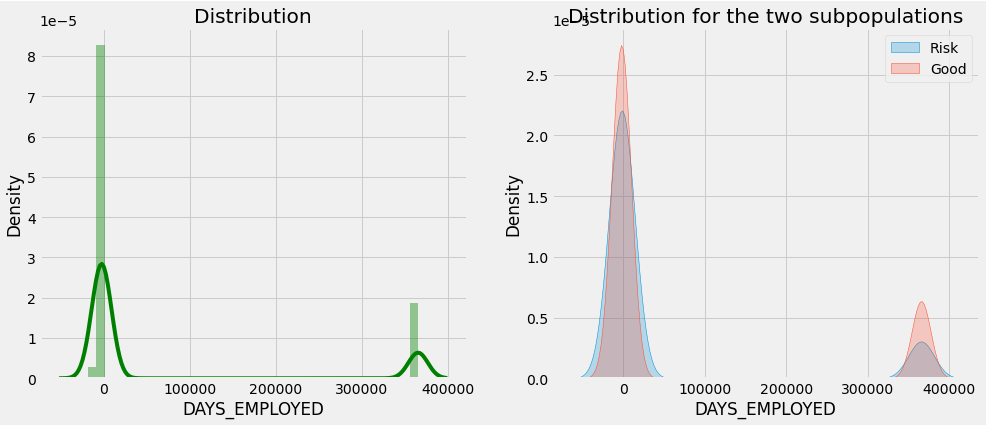
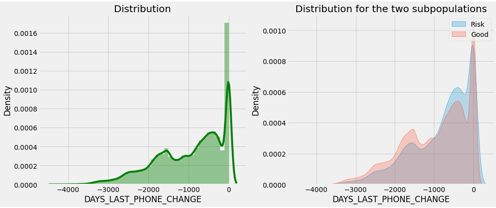

# NEW FEATURES

**FLAG_OWN_CAR + FLAG_OWN_REALTY**

Arabası ve kendine özel mülkü var mı ?

```
FLAG_OWN_CAR : has 2 unique category 	- object

              FLAG_OWN_CAR   Count  Ratio  TARGET_MEAN
FLAG_OWN_CAR                                          
N                   202924  307511 65.989        0.085
Y                   104587  307511 34.011        0.072
```

```
FLAG_OWN_REALTY : has 2 unique category 	- object

   FLAG_OWN_REALTY   Count  Ratio  TARGET_MEAN
N            94199  307511 30.633        0.083
Y           213312  307511 69.367        0.080
```

---

**REG_CITY_NOT_LIVE_CITY:**  Kalıcı adres iletişim adresiyle eşleşmiyorsa 1

```
REG_CITY_NOT_LIVE_CITY : has 2 unique category 	- int64

   REG_CITY_NOT_LIVE_CITY   Count  Ratio  TARGET_MEAN
0                  283472  307511 92.183        0.077
1                   24039  307511  7.817        0.122
```

Güzel bir farklılık var bir şeyler türetilebilir.

---

**REG_CITY_NOT_WORK_CITY:** Kalıcı adres iş adresi ile eşleşmiyorsa 1

```
REG_CITY_NOT_WORK_CITY : has 2 unique category 	- int64

   REG_CITY_NOT_WORK_CITY   Count  Ratio  TARGET_MEAN
0                  236644  307511 76.955        0.073
1                   70867  307511 23.045        0.106
```

Güzel bir farklılık var bir şeyler türetilebilir.

---

**LIVE_CITY_NOT_WORK_CITY**: iletişim adresi iş adresi ile eşleşmiyorsa 1

```
LIVE_CITY_NOT_WORK_CITY : has 2 unique category 	- int64

   LIVE_CITY_NOT_WORK_CITY   Count  Ratio  TARGET_MEAN
0                   252296  307511 82.045        0.077
1                    55215  307511 17.955        0.100
```

---

# NUMERIC FEATURES

**DAYS_BIRTH**


**DAYS_EMPLOYED**




---


---


---


---


---


---


---





---

