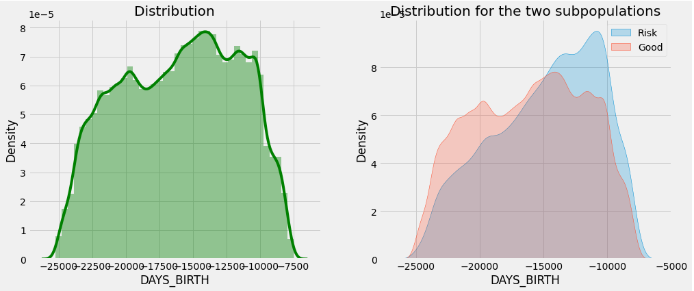
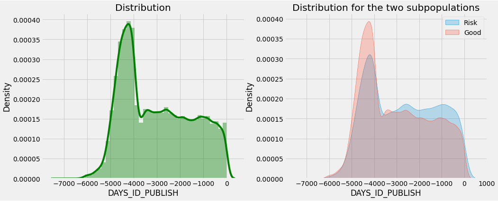
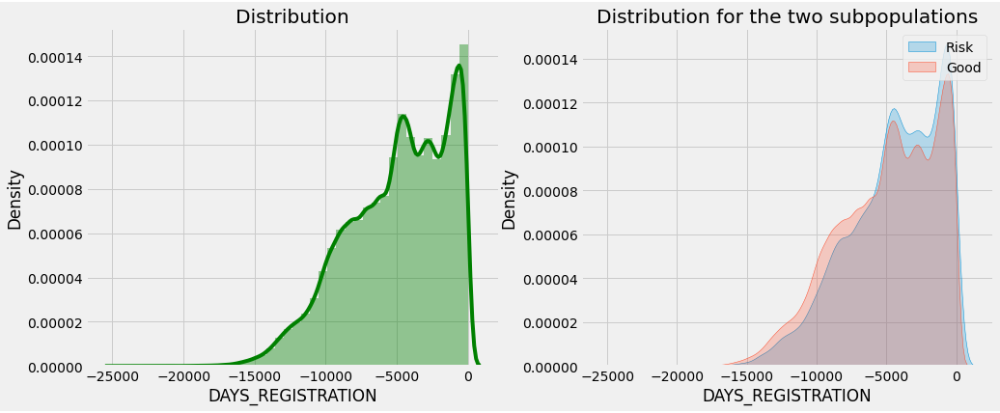
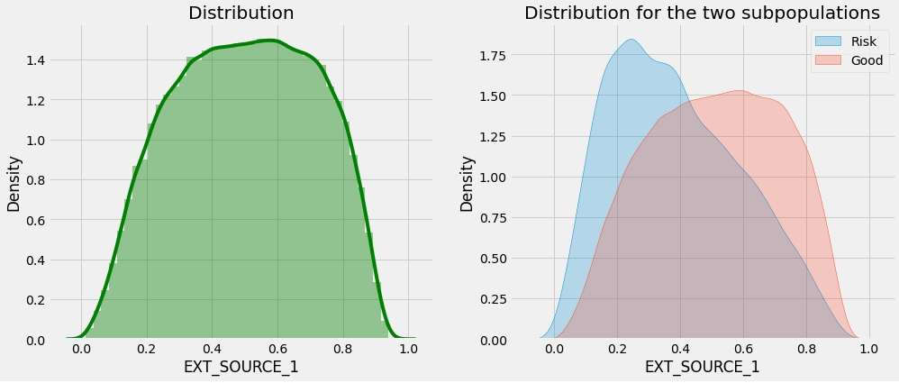
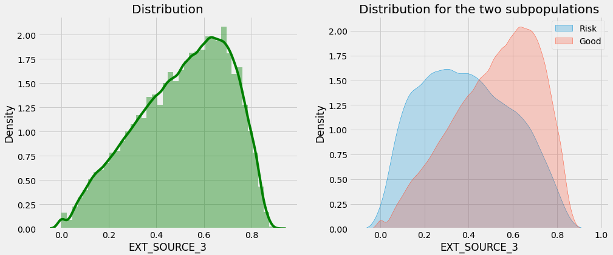

# FEATURE ANALYSIS

## CATEGORIC FEATURES

**CODE_GENDER  - GENDER**

```
CODE_GENDER : has 3 unique category 	- object

             CODE_GENDER   Count  Ratio  TARGET_MEAN
CODE_GENDER                                         
F                 202448  307511 65.834        0.070
M                 105059  307511 34.164        0.101
XNA                    4  307511  0.001        0.000
```

###### *Inferences* : 

It indicates gender and has been 3 classes.

XNA has 4 observation values. It needs to be thrown away.

---

**NAME_TYPE_SUITE :**

```
NAME_TYPE_SUITE : has 7 unique category 	- object

                 NAME_TYPE_SUITE   Count  Ratio  TARGET_MEAN
Children                    3267  307511  1.062        0.074
Family                     40149  307511 13.056        0.075
Group of people              271  307511  0.088        0.085
Other_A                      866  307511  0.282        0.088
Other_B                     1770  307511  0.576        0.098
Spouse, partner            11370  307511  3.697        0.079
Unaccompanied             248526  307511 80.819        0.082
```

###### *Inferences* : 

There are classes close to each other and no variety can be edited or discarded.

---

**NAME_INCOME_TYPE** : 

Who was accompanying the client when applying for a loan?

```
NAME_INCOME_TYPE : has 8 unique category 	- object

                      NAME_INCOME_TYPE   Count  Ratio  TARGET_MEAN
Businessman                         10  307511  0.003        0.000
Commercial associate             71617  307511 23.289        0.075
Maternity leave                      5  307511  0.002        0.400
Pensioner                        55362  307511 18.003        0.054
State servant                    21703  307511  7.058        0.058
Student                             18  307511  0.006        0.000
Unemployed                          22  307511  0.007        0.364
Working                         158774  307511 51.632        0.096
```

###### *Inferences* : 

It can be thrown away.

---

**NAME_EDUCATION_TYPE**  

```
NAME_EDUCATION_TYPE   Count  Ratio  TARGET_MEAN
Academic degree                                164  307511  0.053        0.018
Higher education                             74863  307511 24.345        0.054
Incomplete higher                            10277  307511  3.342        0.085
Lower secondary                               3816  307511  1.241        0.109
Secondary / secondary special               218391  307511 71.019        0.089
```

###### *Inferences* : 

**Labelencoder** can be applied.

---

**NAME_FAMILY_STATUS**

```
NAME_FAMILY_STATUS : has 6 unique category 	- object

                      NAME_FAMILY_STATUS   Count  Ratio  TARGET_MEAN
Civil marriage                     29775  307511  9.683        0.099
Married                           196432  307511 63.878        0.076
Separated                          19770  307511  6.429        0.082
Single / not married               45444  307511 14.778        0.098
Unknown                                2  307511  0.001        0.000
Widow                              16088  307511  5.232        0.058
```

###### *Inferences* : 

The number of classes can be reduced. Married / Not Married

Extreme example: The situations of divorced and male customers can be observed.

---

**NAME_HOUSING_TYPE**

```
NAME_HOUSING_TYPE : has 6 unique category 	- object

                     NAME_HOUSING_TYPE   Count  Ratio  TARGET_MEAN
Co-op apartment                   1122  307511  0.365        0.079
House / apartment               272868  307511 88.734        0.078
Municipal apartment              11183  307511  3.637        0.085
Office apartment                  2617  307511  0.851        0.066
Rented apartment                  4881  307511  1.587        0.123
With parents                     14840  307511  4.826        0.117
```

###### *Inferences* : 

Classes can be demoted. The default situation is higher for those who live with their families and rent apartments.

---

**FLAG_MOBIL**

```
FLAG_MOBIL : has 2 unique category 	- int64

   FLAG_MOBIL   Count   Ratio  TARGET_MEAN
0           1  307511   0.000        0.000
1      307510  307511 100.000        0.081
```

###### *Inferences* : 

It needs to be thrown away.


**FLAG_EMP_PHONE**

```
FLAG_EMP_PHONE : has 2 unique category 	- int64

   FLAG_EMP_PHONE   Count  Ratio  TARGET_MEAN
0           55386  307511 18.011        0.054
1          252125  307511 81.989        0.087
```

###### *Inferences* : 

It seems unnecessary, it can be thrown away.

---

**FLAG_PHONE**

```
FLAG_PHONE : has 2 unique category 	- int64

   FLAG_PHONE   Count  Ratio  TARGET_MEAN
0      221080  307511 71.893        0.085
1       86431  307511 28.107        0.070
```

###### *Inferences* : 

It seems unnecessary, it can be thrown away.

---

**FLAG_EMAIL**

```
FLAG_EMAIL : has 2 unique category 	- int64

   FLAG_EMAIL   Count  Ratio  TARGET_MEAN
0      290069  307511 94.328        0.081
1       17442  307511  5.672        0.079
```

###### *Inferences* : 

It seems unnecessary, it can be thrown away.

---

**WEEKDAY_APPR_PROCESS_START**

```
WEEKDAY_APPR_PROCESS_START : has 7 unique category 	- object

           WEEKDAY_APPR_PROCESS_START   Count  Ratio  TARGET_MEAN
FRIDAY                          50338  307511 16.369        0.081
MONDAY                          50714  307511 16.492        0.078
SATURDAY                        33852  307511 11.008        0.079
SUNDAY                          16181  307511  5.262        0.079
THURSDAY                        50591  307511 16.452        0.081
TUESDAY                         53901  307511 17.528        0.084
WEDNESDAY                       51934  307511 16.889        0.082
```

###### *Inferences* : 

It can be thrown away it is pointless.


**REG_REGION_NOT_LIVE_REGION**

```
REG_REGION_NOT_LIVE_REGION : has 2 unique category 	- int64

   REG_REGION_NOT_LIVE_REGION   Count  Ratio  TARGET_MEAN
0                      302854  307511 98.486        0.081
1                        4657  307511  1.514        0.093
```

###### *Inferences* : 

No variety can be discarded.


**REG_REGION_NOT_WORK_REGION**

```
REG_REGION_NOT_WORK_REGION : has 2 unique category 	- int64

   REG_REGION_NOT_WORK_REGION   Count  Ratio  TARGET_MEAN
0                      291899  307511 94.923        0.080
1                       15612  307511  5.077        0.089
```

###### *Inferences* : 

No difference can be thrown away.

---

**LIVE_REGION_NOT_WORK_REGION**

```
LIVE_REGION_NOT_WORK_REGION : has 2 unique category 	- int64

   LIVE_REGION_NOT_WORK_REGION   Count  Ratio  TARGET_MEAN
0                       295008  307511 95.934        0.081
1                        12503  307511  4.066        0.084
```

###### *Inferences* : 

No difference can be thrown away.

---

**FONDKAPREMONT_MODE** ???

```
FONDKAPREMONT_MODE : has 4 unique category 	- object

                       FONDKAPREMONT_MODE   Count  Ratio  TARGET_MEAN
not specified                        5687  307511  1.849        0.075
org spec account                     5619  307511  1.827        0.058
reg oper account                    73830  307511 24.009        0.070
reg oper spec account               12080  307511  3.928        0.066

```

###### *Inferences* : 

It looks frivolous, it seems throwable.

---

**HOUSETYPE_MODE**

```
HOUSETYPE_MODE : has 3 unique category 	- object

                  HOUSETYPE_MODE   Count  Ratio  TARGET_MEAN
HOUSETYPE_MODE                                              
block of flats            150503  307511 48.942        0.069
specific housing            1499  307511  0.487        0.101
terraced house              1212  307511  0.394        0.085
```

###### *Inferences* : 

It should be thrown away.

---

**WALLSMATERIAL_MODE**

```
WALLSMATERIAL_MODE : has 7 unique category 	- object

              WALLSMATERIAL_MODE   Count  Ratio  TARGET_MEAN
Block                       9253  307511  3.009        0.070
Mixed                       2296  307511  0.747        0.075
Monolithic                  1779  307511  0.579        0.047
Others                      1625  307511  0.528        0.083
Panel                      66040  307511 21.476        0.063
Stone, brick               64815  307511 21.077        0.074
Wooden                      5362  307511  1.744        0.097
```

###### *Inferences* : 

It should be thrown away.

---

**EMERGENCYSTATE_MODE**

```
EMERGENCYSTATE_MODE : has 2 unique category 	- object

                     EMERGENCYSTATE_MODE   Count  Ratio  TARGET_MEAN
EMERGENCYSTATE_MODE                                                 
No                                159428  307511 51.845        0.070
Yes                                 2328  307511  0.757        0.096
```

###### *Inferences* : 

There are very few observations that can be thrown away.

---

**FLAG_DOCUMENT_XX**

###### *Inferences* : 

The totals of all document numbers can be taken. There are 20 of them.

---

**AMT_REQ_CREDIT_BUREAU_HOUR** : 

The number of inquiries made to the credit bureau about the customer one hour before the application.

```
AMT_REQ_CREDIT_BUREAU_HOUR : has 5 unique category 	- float64

       AMT_REQ_CREDIT_BUREAU_HOUR   Count  Ratio  TARGET_MEAN
0.000                      264366  307511 85.970        0.077
1.000                        1560  307511  0.507        0.080
2.000                          56  307511  0.018        0.107
3.000                           9  307511  0.003        0.000
4.000                           1  307511  0.000        0.000
```

###### *Inferences* : 

Seems to be pointless.

---

**DEF_60_CNT_SOCIAL_CIRCLE**

```
DEF_60_CNT_SOCIAL_CIRCLE : has 9 unique category 	- float64

        DEF_60_CNT_SOCIAL_CIRCLE   Count  Ratio  TARGET_MEAN
0.000                     280721  307511 91.288        0.078
1.000                      21841  307511  7.103        0.105
2.000                       3170  307511  1.031        0.121
3.000                        598  307511  0.194        0.159
4.000                        135  307511  0.044        0.111
5.000                         20  307511  0.007        0.150
6.000                          3  307511  0.001        0.000
7.000                          1  307511  0.000        0.000
24.000                         1  307511  0.000        0.000
```

###### *Inferences* : 

It needs to be worked on.

------


# FEATURE ENGINEERING SUGGESTIONS

**FLAG_OWN_CAR + FLAG_OWN_REALTY**

Does the customer have a Car and private property?

```
FLAG_OWN_CAR : has 2 unique category 	- object

              FLAG_OWN_CAR   Count  Ratio  TARGET_MEAN
FLAG_OWN_CAR                                          
N                   202924  307511 65.989        0.085
Y                   104587  307511 34.011        0.072
```

```
FLAG_OWN_REALTY : has 2 unique category 	- object

   FLAG_OWN_REALTY   Count  Ratio  TARGET_MEAN
N            94199  307511 30.633        0.083
Y           213312  307511 69.367        0.080
```

---

**REG_CITY_NOT_LIVE_CITY:**  

1 , if the permanent address does not match the contact address

```
REG_CITY_NOT_LIVE_CITY : has 2 unique category 	- int64

   REG_CITY_NOT_LIVE_CITY   Count  Ratio  TARGET_MEAN
0                  283472  307511 92.183        0.077
1                   24039  307511  7.817        0.122
```

###### *Inferences* : 

There is a nice difference, something can be derived.

---

**REG_CITY_NOT_WORK_CITY:** 

1, if the permanent address does not match the business address

```
REG_CITY_NOT_WORK_CITY : has 2 unique category 	- int64

   REG_CITY_NOT_WORK_CITY   Count  Ratio  TARGET_MEAN
0                  236644  307511 76.955        0.073
1                   70867  307511 23.045        0.106
```

###### *Inferences* : 

There is a nice difference, something can be derived.

---

**LIVE_CITY_NOT_WORK_CITY**: 

1 , if the contact address does not match the business address

```
LIVE_CITY_NOT_WORK_CITY : has 2 unique category 	- int64

   LIVE_CITY_NOT_WORK_CITY   Count  Ratio  TARGET_MEAN
0                   252296  307511 82.045        0.077
1                    55215  307511 17.955        0.100
```

---


## **NUMERICAL FEATURES**

**DAYS_BIRTH**



###### *Inferences* : 

A difference between approximately -15000 and -8000 was observed in this variable.

---

**DAYS_EMPLOYED**


###### *Inferences* : 

Noise between -350000 and -400000 was detected in this variable given in days. These numbers correspond to approximately 1000 years. It needs to be removed.

---

---

**DAYS_ID_PUBLISH**



###### *Inferences* : 

In this variable, a difference between -3000 and 0 was observed.

---

**DAYS_LAST_PHONE_CHANGE**


###### *Inferences* : 

A difference between -900 and -100 was observed in this variable indicating the replacement time of the last phone.

---

**DAYS_REGISTRATION**



###### *Inferences* : 

A difference between -5000 and 0 was observed.

------


**EXT_SOURCE_1**



###### *Inferences* : 

Significant differences were observed in this variable, which includes scores from other sources.

------


**EXT_SOURCE_2**


###### *Inferences* :  

Significant differences were observed in this variable, which includes scores from other sources.

------


**EXT_SOURCE_3**



###### *Inferences* : 

Significant differences were observed in this variable, which includes scores from other sources.

------

