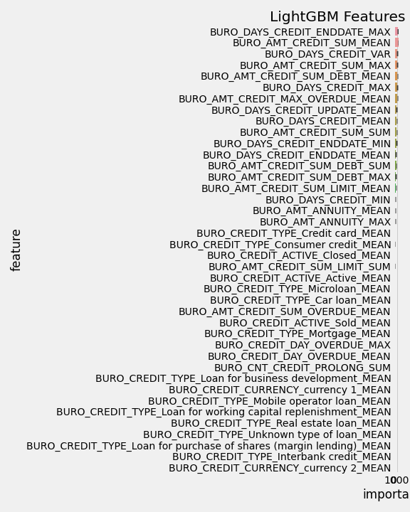

# Data Preprocessing

**CREDIT_CURRENCY**

------

Kategorilerdeki gözlem sayıları düşük oldugu için  0 ve 1 şeklinde ayarlandı.

```python
df.loc[(df["CREDIT_CURRENCY"] == "currency 1"),"CREDIT_CURRENCY"] = 0 "Current 1"
df.loc[(df["CREDIT_CURRENCY"] == "currency 2"),"CREDIT_CURRENCY"] = 1 "Current 2"
df.loc[(df["CREDIT_CURRENCY"] == "currency 3"),"CREDIT_CURRENCY"] = 1 "Current 3"
df.loc[(df["CREDIT_CURRENCY"] == "currency 4"),"CREDIT_CURRENCY"] = 1 "Current 4"
```

**CREDIT_ACTIVE**

------

Bu değişkende **Sold** ve **Bad Debt**  sınıfları verisetinde az olmasından dolayı anlamlı bir farklılık sağlamıyor bu sebeple **Active** olarak atandı.

```python
bureau.loc[(bureau["CREDIT_ACTIVE"] == "Bad debt"),"CREDIT_ACTIVE"] = "Active"
bureau.loc[(bureau["CREDIT_ACTIVE"] == "Sold"),"CREDIT_ACTIVE"] = "Active"
```


**CNT_CREDIT_PROLONG **

---

Kredinin kaç kez uzatıldıgını gösteren değişken. 

```python
CNT_CREDIT_PROLONG : has 10 unique category 	- int64

   CNT_CREDIT_PROLONG    Count  Ratio
0             1707314  1716428 99.469
1                7620  1716428  0.444
2                1222  1716428  0.071
3                 191  1716428  0.011
4                  54  1716428  0.003
5                  21  1716428  0.001
9                   2  1716428  0.000
6                   2  1716428  0.000
8                   1  1716428  0.000
7                   1  1716428  0.000
```

0. sınıf hariç anlamlı bir çeşitlilik sağlamadığı için 0 ve 1 şeklinde binary encoding uygulandı.

```python
df.loc[(df["CNT_CREDIT_PROLONG"] == 0),"CNT_CREDIT_PROLONG"] = 0 #diğer yerlerdeki kredisini uzatmamış kişiler
df.loc[(df["CNT_CREDIT_PROLONG"] != 0),"CNT_CREDIT_PROLONG"] = 1 #diğer yerlerdeki kredisini uzatmış kişiler
```


**CREDIT_TYPE **

------

Kredi tipini gösteren değişken 15 kategorisi var ;

```python
CREDIT_TYPE : has 15 unique category    - object                                              CREDIT_TYPE    Count Ratio  
    1251615  1716428 72.920 Consumer credit                         
     402195  1716428 23.432  Credit card                                  
      27690  1716428  1.613   Car loan
      18391  1716428  1.071   Mortgage                                  
```

%1 in altında olan kategorilerine rare encoding uygulayacagız.

```python
bureau.loc[(bureau["CREDIT_TYPE"] == "Microloan"),"CREDIT_TYPE"] = "Rare"
bureau.loc[(bureau["CREDIT_TYPE"] == "Loan for business development"),"CREDIT_TYPE"] = "Rare"
bureau.loc[(bureau["CREDIT_TYPE"] == "Another type of loan"),"CREDIT_TYPE"] = "Rare"
bureau.loc[(bureau["CREDIT_TYPE"] == "Loan for working capital replenishment"),"CREDIT_TYPE"] = "Rare"
bureau.loc[(bureau["CREDIT_TYPE"] == "Unknown type of loan"),"CREDIT_TYPE"] = "Rare"
bureau.loc[(bureau["CREDIT_TYPE"] == "Cash loan (non-earmarked)"),"CREDIT_TYPE"] = "Rare"
bureau.loc[(bureau["CREDIT_TYPE"] == "Real estate loan"),"CREDIT_TYPE"] = "Rare"
bureau.loc[(bureau["CREDIT_TYPE"] == "Loan for the purchase of equipment"),"CREDIT_TYPE"] = "Rare"
```


## **NEW FEATURES**

**Feature1**

**Bir müşterinin  farklı olarak sahip oldugu kredi sayısı :**

**BUREAU_LOAN_COUNT**

```python
grp = df[['SK_ID_CURR', 'DAYS_CREDIT']].groupby(by = ['SK_ID_CURR'])['DAYS_CREDIT'].count().reset_index().rename(index=str, columns={'DAYS_CREDIT': 'BUREAU_LOAN_COUNT'})
```

Ve bu sonucları tabloya ekliyoruz.

```python
df = df.merge(grp, on = ['SK_ID_CURR'], how = 'left')
```

**Feature2**

 **Bir müşterinin kaç farklı tipte krediye sahip oldugu :**

**BUREAU_LOAN_TYPES**

```python
grp = df[['SK_ID_CURR', 'CREDIT_TYPE']].groupby(by = ['SK_ID_CURR'])['CREDIT_TYPE'].nunique().reset_index().rename(index=str, columns={'CREDIT_TYPE': 'BUREAU_LOAN_TYPES'})
```

Ve bu sonucları tabloya ekliyoruz.

```python
df = df.merge(grp, on = ['SK_ID_CURR'], how = 'left')
```

**Feature3**  

**Bir müşterinin aldıgı farklı kredi türlerinin oranı :**

**AVERAGE_LOAN_TYPE**

Bir kişinin kaç farklı tipte krediye sahip olduğuna önceki featuredan biliyorduk loan types.

```python
grp = df[['SK_ID_CURR', 'CREDIT_TYPE']].groupby(by = ['SK_ID_CURR'])['CREDIT_TYPE'].nunique().reset_index().rename(index=str, columns={'CREDIT_TYPE': 'BUREAU_LOAN_TYPES'})
```

Oranı bulmak için

```python
df['AVERAGE_LOAN_TYPE'] = df['BUREAU_LOAN_COUNT']/df['BUREAU_LOAN_TYPES'] 
```

Ve bu sonucları tabloya ekliyoruz.

```python
df = df.merge(grp, on = ['SK_ID_CURR'], how = 'left')
del df['BUREAU_LOAN_COUNT'], df['BUREAU_LOAN_TYPES']
```


**Feature4** 

**Bureau datasındaki aktif durumda olan kredilerin diğer kredilerine göre yüzdesi :**

**ACTIVE_LOANS_PERCENTAGE**

Bu değişkende sonucların 1 e yakın olması bizim için kötü bir durum aktif olan kredilerinin fazla oldugunu bize gösteriyor.

Kredi aktif mi değil mi diye ayırmak  için  yeni bir değişken olusturuyoruz

```python
df['CREDIT_ACTIVE_BINARY'] = df['CREDIT_ACTIVE']

df.loc[(B['CREDIT_ACTIVE'] == "Closed"), 'CREDIT_ACTIVE_BINARY'] = 0 df.loc[(B['CREDIT_ACTIVE'] != "Closed"), 'CREDIT_ACTIVE_BINARY'] = 1
      
```

Müşteri başına AKTİF olan ortalama kredi sayısını hesaplayın

```python
['CREDIT_ACTIVE_BINARY'] = df['CREDIT_ACTIVE_BINARY'].astype('int32')# Mgrp = df.groupby(by = ['SK_ID_CURR'])
['CREDIT_ACTIVE_BINARY'].mean().reset_index().rename(index=str, columns={'CREDIT_ACTIVE_BINARY': 'ACTIVE_LOANS_PERCENTAGE'})
```

Ve bu sonucları tabloya ekliyoruz.

```python
df = df.merge(grp, on = ['SK_ID_CURR'], how = 'left') 
del df['CREDIT_ACTIVE_BINARY']
```


**Feature5**

**Bir kişinin kaç gün aralıklar ile yeni krediler aldıgını bulmak icin :**

**DAYS_CREDIT_DIFF**

Bir kişinin aldığı farklı kredilerin alınma günleri sıraladık ;

```python
grp = B[['SK_ID_CURR', 'SK_ID_BUREAU', 'DAYS_CREDIT']].groupby(by = ['SK_ID_CURR'])
grp1 = grp.apply(lambda x: x.sort_values(['DAYS_CREDIT'], ascending = False)).reset_index(drop = True)#rename(index = str, columns = {'DAYS_CREDIT': 'DAYS_CREDIT_DIFF'})
```

Krediler arasında ki gün farkı hesaplanıyor ;

```python
grp1['DAYS_CREDIT1'] = grp1['DAYS_CREDIT']*-1
grp1['DAYS_DIFF'] = grp1.groupby(by = ['SK_ID_CURR'])['DAYS_CREDIT1'].diff()
grp1['DAYS_DIFF'] = grp1['DAYS_DIFF'].fillna(0).astype('uint32')
del grp1['DAYS_CREDIT1'], grp1['DAYS_CREDIT'], grp1['SK_ID_CURR']
```

Ve bu sonucları ana tabloya ekliyoruz ;

```python
B = B.merge(grp1, on = ['SK_ID_BUREAU'], how = 'left')
```

**Feature6**

**Müşteri bazlı ödemesi devam eden kredi sayılarının ortalamaları**

**CREDIT_ENDDATE_PERCENTAGE**

Burada sonuçlarımızın 1 e yakın olması kötüye işaret.

Yeni bir değişken oluşturuyoruz.

```python
B['CREDIT_ENDDATE_BINARY'] = B['DAYS_CREDIT_ENDDATE']
```

Odemesi bitmiş (Closed) kredilere "0" , ödemesi devam eden (Active) kredilere 1 veriyoruz.

```python
B.loc[(B['DAYS_CREDIT_ENDDATE'] < 0),"CREDIT_ENDDATE_BINARY"] = 0 
B.loc[(B['DAYS_CREDIT_ENDDATE'] >= 0),"CREDIT_ENDDATE_BINARY"] = 1
```

Ödemesi devam eden kredi sayısının ortalamaları sonuc 1 e yakın ise bizim için kötü yani çok fazla aktif krediye sahip , 0 a yakın ise sonuç bizim için iyi yani daha az aktip kredisi var.

```python
grp = B.groupby(by = ['SK_ID_CURR'])['CREDIT_ENDDATE_BINARY'].mean().reset_index().rename(index=str, columns={'CREDIT_ENDDATE_BINARY': 'CREDIT_ENDDATE_PERCENTAGE'})
```

Ve bu sonucları ana tabloya ekliyoruz.

```python
B = B.merge(grp, on = ['SK_ID_CURR'], how = 'left') 

del B['CREDIT_ENDDATE_BINARY'] #gereksiz olan binary columnun düşürülmesi
```

**Feature7**

**Ödenen borç yüzdesi**

**NEW_AMT_PER_PAY**

0'a yakın olması iyi  1 e yakın olması kötü tıpkı Target gibi

AMT_CREDIT_SUM toplam kredi miktarını gösteriyor.

AMT_CREDIT_SUM_DEBT ise kalan borç tutarını gösteriyor.

Tek müşterinin eksi kredilerinin tamamına mean atılabilir. (ödenen borç yüzdelerine)

```python
df[NEW_AMT_PER_PAY]= 1 - ((df["AMT_CREDIT_SUM"]- df["AMT_CREDIT_SUM_DEBT"]) / df["AMT_CREDIT_SUM"])
```

**Feature8**

```python
#NOT: Groupby aggregation işleminde mean ve sum alınabilir

B = bureau[0:10000]
B['CREDIT_ENDDATE_BINARY'] = B['DAYS_CREDIT_ENDDATE']

# Ödemesi devam edenler(+) ve ödemesi bitmiş olanlar(0 veya -) değerler belirtiliyor
B.loc[(bureau["DAYS_CREDIT_ENDDATE"] <= 0), "CREDIT_ENDDATE_BINARY"] = 0 #ödemesi bitmiş (Closed) krediler
B.loc[(bureau["DAYS_CREDIT_ENDDATE"] > 0), "CREDIT_ENDDATE_BINARY"] = 1 #ödemesi devam eden (Active) krediler

#Ödemesi devam eden krediler üzerinde işlem yapılacak
B1 = B[B['CREDIT_ENDDATE_BINARY'] == 1]

#Ödemesi tamamlanmaya krediler arasındaki gün farklarının hesaplanması

# Create Dummy Column for CREDIT_ENDDATE 
B1['DAYS_CREDIT_ENDDATE1'] = B1['DAYS_CREDIT_ENDDATE']
# Groupby Each Customer ID 
grp = B1[['SK_ID_CURR', 'SK_ID_BUREAU', 'DAYS_CREDIT_ENDDATE1']].groupby(by = ['SK_ID_CURR'])
# Kredi ödeme sürelerinin kişi özelinde küçükten büyüğe sıralanması
grp1 = grp.apply(lambda x: x.sort_values(['DAYS_CREDIT_ENDDATE1'], ascending = True)).reset_index(drop = True) 
del grp
gc.collect()
print("Grouping and Sorting done")

# diff fonksiyonunda ilk satırlarda gelen nan valuler 0 ile dolduruldu.
grp1['DAYS_ENDDATE_DIFF'] = grp1.groupby(by = ['SK_ID_CURR'])['DAYS_CREDIT_ENDDATE1'].diff()
grp1['DAYS_ENDDATE_DIFF'] = grp1['DAYS_ENDDATE_DIFF'].fillna(0).astype('uint32')
del grp1['DAYS_CREDIT_ENDDATE1'], grp1['SK_ID_CURR']
gc.collect()
print("Difference days calculated")

# ana tablo ile birleştirilmesi
B = B.merge(grp1, on = ['SK_ID_BUREAU'], how = 'left')
del grp1
gc.collect()

```

**Feature9**

**Kişinin toplam gecikmiş borcunun toplam mevcut borcuna oranı**

**OVERDUE_DEBT_RATIO**

B = df[0:10000]

nan değerler borç yok olarak alındı.

```python
B['AMT_CREDIT_SUM_DEBT'] = B['AMT_CREDIT_SUM_DEBT'].fillna(0)
```

nan değerler gecikme yok olarak alındı.

```python
B['AMT_CREDIT_SUM_OVERDUE'] = B['AMT_CREDIT_SUM_OVERDUE'].fillna(0) 


```

grp1 bir kişinin toplam borcu

```python
grp1 = B[['SK_ID_CURR', 'AMT_CREDIT_SUM_DEBT']].groupby(by = ['SK_ID_CURR'])['AMT_CREDIT_SUM_DEBT'].sum().reset_index().rename( index = str, columns = {'AMT_CREDIT_SUM_DEBT': 'TOTAL_CUSTOMER_DEBT'})
```

grp2 bir kişinin toplam gecikmiş borcu

```python
grp2 = B[['SK_ID_CURR', 'AMT_CREDIT_SUM_OVERDUE']].groupby(by = ['SK_ID_CURR'])['AMT_CREDIT_SUM_OVERDUE'].sum().reset_index().rename( index = str, columns = {'AMT_CREDIT_SUM_OVERDUE': 'TOTAL_CUSTOMER_OVERDUE'})


```

Ve sonuclarımızı ana tabloya ekliyoruz.

```python
B = B.merge(grp1, on = ['SK_ID_CURR'], how = 'left')
B = B.merge(grp2, on = ['SK_ID_CURR'], how = 'left')
```

Artık işimize yaramayacak degikenleri siliyoruz.

```python
del grp1, grp2
gc.collect()
```

kişinin toplam gecikmiş borcunun, toplam borcuna oranı

```python
B['OVERDUE_DEBT_RATIO'] = B['TOTAL_CUSTOMER_OVERDUE']/B['TOTAL_CUSTOMER_DEBT'] 
```

Gereksiz üretilen sütunlar kaldırıldı

```python
del B['TOTAL_CUSTOMER_OVERDUE'], B['TOTAL_CUSTOMER_DEBT'] 
gc.collect()
```

Bu adımdan sonra One Hot Encoding uygulayarak kategorik değiskenlerimizi numeric hale getiriyoruz.

```python
bureau, bureau_cat = one_hot_encoder(bureau, nan_as_category=True)
```

Devamında ise Bureau setimiz için numeric feature'ler türetiyoruz.

```python
num_aggregations = {
        'DAYS_CREDIT': ['min', 'max', 'mean', 'var'],
        'DAYS_CREDIT_ENDDATE': ['min', 'max', 'mean'],
        'DAYS_CREDIT_UPDATE': ['mean'],
        'CREDIT_DAY_OVERDUE': ['max', 'mean'],
        'AMT_CREDIT_MAX_OVERDUE': ['mean'],
        'AMT_CREDIT_SUM': ['max', 'mean', 'sum'],
        'AMT_CREDIT_SUM_DEBT': ['max', 'mean', 'sum'],
        'AMT_CREDIT_SUM_OVERDUE': ['mean'],
        'AMT_CREDIT_SUM_LIMIT': ['mean', 'sum'],
        'AMT_ANNUITY': ['max', 'mean'],
        'CNT_CREDIT_PROLONG': ['sum'],
        "NEW_DANGER" : ["max"],
        "NEW_BUREAU_LOAN_COUNT" : ["max"],
        "NEW_AVERAGE_LOAN_TYPE" : ["mean"],
        "NEW_ACTIVE_LOANS_PERCENTAGE" : ["max"],
        "NEW_DAYS_DIFF" : ["min","max","mean"],
        "NEW_CREDIT_ENDDATE_PERCENTAGE" : ["mean"],
        "NEW_AMT_PER_PAY" : ["min","max","mean"],
        "DAYS_ENDDATE_DIFF" : ["mean","sum","min"],
        "NEW_OVERDUE_DEBT_RATIO" : ["mean"]

}
```

Categoric Featuerlar için ;

```python
cat_aggregations = {}
for cat in bureau_cat: cat_aggregations[cat] = ['mean']
#for cat in bb_cat: cat_aggregations[cat + "_MEAN"] = ['mean'] 
#Sadece bureau ile ilgilendigimiz icin bb'sı almıyoruz
```

Sonrasında bu türettiğimiz degiskenler ile bureau'yu groupby'layacagız.

```python
bureau_agg = bureau.groupby('SK_ID_CURR').agg({**num_aggregations, **cat_aggregations})
```

Urettigimiz yeni degiskenlerin anlasılması icin onlerine BURO eklemek istiyoruz.

```python
bureau_agg.columns = pd.Index(['BURO_' + e[0] + "_" + e[1].upper() for e in bureau_agg.columns.tolist()])
```

Model öncesi değişken sayıları:

```python
train_df.shape
(307511, 55)

test_df.shape
(48744, 55)
```

**Model Sonucu:**



