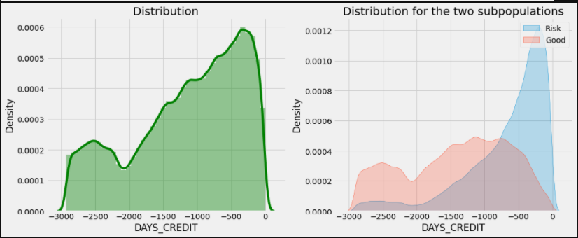

# FEATURE ANALYSIS


# **MISSING VALUES**

| Missing Values         | % of Total Values |        |
| ---------------------- | ----------------- | ------ |
| AMT_ANNUITY            | 1226791           | 71.500 |
| AMT_CREDIT_MAX_OVERDUE | 1124488           | 65.500 |
| DAYS_ENDDATE_FACT      | 633653            | 36.900 |
| AMT_CREDIT_SUM_LIMIT   | 591780            | 34.500 |
| AMT_CREDIT_SUM_DEBT    | 257669            | 15.000 |
| DAYS_CREDIT_ENDDATE    | 105553            | 6.100  |
| AMT_CREDIT_SUM         | 13                | 0.000  |


**DAYS_CREDIT**

------

Müsteri mevcut başvurudan kaç gün önce Kredi bürosuna başvurdu.(Başka bir kredi için)(Gün bazlı değişken)

min değerimiz 2922 ve bu değer 8 yıla tekabül ediyor.



-1000 günden yüksek değerlerde farklılık gözlemlendi.

**CREDIT_CURRENCY**

------

Kredi bürosunun kredisinin yeniden kodlanmış para birimi şeklinde tanımlanıyor.

4 adet alt grubu var bunlar : 

```
currency 1 , currency 2 , currency 3 , currency 4  
```

**CREDIT_ACTIVE**

------

Durumu bildirilen krediler  **Closed** , **Active** , **Sold** , **Bad Deb**t şeklinde alt kümelere sahip.

Bu değişkende **Sold** ve **Bad Debt**  sınıfları verisetinde az olmasından dolayı anlamlı bir farklılık sağlamıyor bu sebeple **Active** olarak atanabilir.


**CNT_CREDIT_PROLONG **

---

Kredinin kaç kez uzatıldıgını gösteren değişken. 

```python
CNT_CREDIT_PROLONG : has 10 unique category 	- int64

   CNT_CREDIT_PROLONG    Count  Ratio
0             1707314  1716428 99.469
1                7620  1716428  0.444
2                1222  1716428  0.071
3                 191  1716428  0.011
4                  54  1716428  0.003
5                  21  1716428  0.001
9                   2  1716428  0.000
6                   2  1716428  0.000
8                   1  1716428  0.000
7                   1  1716428  0.000
```


**CREDIT_TYPE **

------

Kredi tipini gösteren değişken 15 kategorisi var ;

```python
CREDIT_TYPE : has 15 unique category    - object                                              CREDIT_TYPE    Count Ratio  
    1251615  1716428 72.920 Consumer credit                         
     402195  1716428 23.432  Credit card                                  
      27690  1716428  1.613   Car loan
      18391  1716428  1.071   Mortgage                                  
```


**CREDIT_DAY_OVERDUE**

------

Müşterinin diğer kredilerini geciktirme durumlarını gün olarak ifade ediyor

```
0: geciktirmemiş 1: geciktirmiş olarak kodlanabilir
```

**UYGULANMADI**


**DAYS_CREDİT_ENDDATE **

------

Kredi başvurusundan kaç gün önce önceki kredisinin bittiği ya da kaç günleri kaldıgı bilgisini verir.

Yapılan sektör araştırmalarına göre dünya da en uzun görülen kredi türü olan mortgage da 50 yıl saptanmıştır oguz bey tarafından.

En yaşlı başvuran kişi 69 yaşındadır. Bu kişi 18 yaşında krediye başvurmuş olsa dahi 50 yıllık ödemeyi karsılayabilecek yaş seviyesindedir. Bunu göz önünde bulundurarak days credit değişkeninde max sınırımızı 50 yıl olarak alacağız. 50 yıldan uzun olan verileri atacağız.

0 dan geriye gidenler  ödemesini tamamlayan kitleyi oluşturur. Credit_Active durumları : CLOSED

0 dan pozitif yönde hareket edenlerin ödemesi devam etmektedir. Credit_Active durumları : ACTIVE


**DAYS_ENDDATE_FACT**

------

Ev kredisi başvurusu sırasında Credi bürosunda bulunan eski kredisinin sona ermesinden bu yana geçen süre gün cinsinden ( Yalnızca kapalı kredi ). Maximum değer 0 gorüldü bunun sebesi ise yalnızca kapalı olan yani ödemesi sone ermiş kredilerin bu değişkende yer alması.

Days_credit_enddate ve days_enddate_fact değigskenlerinde minumum değerlerin -42023  (115 yıla yakın bir değere tekabül ediyor.)(oldugu tespit edilmiş ve bu değere gürültü adı verilmiştir.


**AMT_CREDIT_OVERDUE**

------

Kredi bürosu  bulunan kredisinde su ana kadar gecikmiş maksimum kredi tutarı(Home Credit Kredi basvuru tarihine kadar)

Eksik değerler denklem dısında tutuldugunda (112.000)

None değerlere mantıklı olması sebebi ile 0 atandı bu durum model olusturulduktan sonra kontrol edilecek.

Değişken incelendiğinde  müşterilerin %75 inin gecikmis kredi ödemesi bulunmamakta. Gecikmis olanları ise geciktirilmiş miktarlarına göre sınıflandırabiliriz.

%99 dan büyük olan dilim incelendiğinde en düşük borç tutarı 41.989 oldugu görüldü.En yüksek tutar ise 115.987.185 oldugu görüldü.

